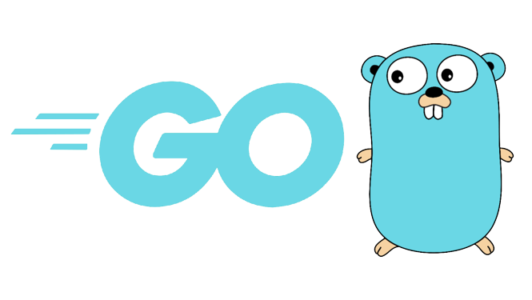
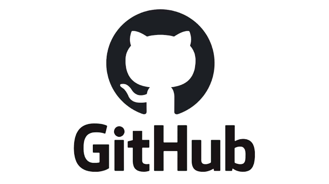

# Image Editor

- Universidad de La Laguna
- **Subject:** Computer vision
- **Final Project of Subject:** Image editor prototype

## Index
- [Authors](#authors)
- [Description](#description)
- [Resources used](#recursos-used)
- [Directory structure](#directory-structure)

## Authors
  - Carlos García Lezcano - alu0101208268@ull.edu.es
  - Eduardo Expósito Barrera - alu0101230382@ull.edu.es

## Description
  - This repository contains a final project of the subject Computer Vision. The project consisted of a prototype of an image editor with different operations seen in the subject.

## Resources used
- The following resources have been used to carry out the project:
    - **[Go](https://go.dev/):** Programming language used for development.
     
    

      
    
 
    
    - **[Github](https://github.com/):** Software used to maintain version control of the developed code.
     
    

      
    

    
    - **[Discord](https://discord.com/):** Application used for equipment communication.
     
    

      
    
 

## Directory structure
- The directory is organized as follows:

      .
      ├── img
          ├── Discord.png
          ├── Git.png
          ├── Go.png
      ├── pkg
          ├── histogram
              ├── histogram.go
          ├── imageContent
              ├── imageContent.go
          ├── information
              ├── information.go
          ├── loadandsave
              ├── loadandsave.go
          ├── menu
              ├── menu.go
          ├── mouse
              ├── mousEvents.go
          ├── newWindow
              ├── newWindow.go
          ├── operations
              ├── operations.go
      ├── testImages
          ├── lena.tiff
          ├── lena2.tiff
          ├── lena3.tiff
          ├── tanque-anterior.tiff
          ├── tanque-posterior.tiff
      ├── go.mod
      ├── go.sum
      ├── main.go